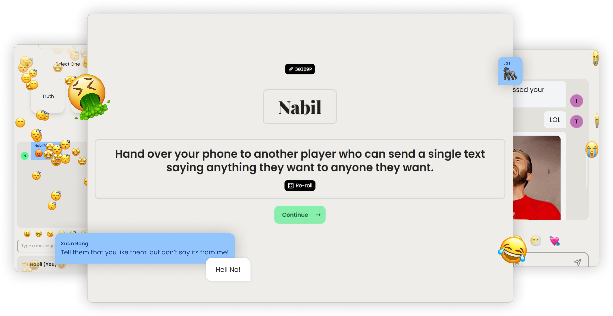

<p align="center">
  
</p>

<h1 align="center">Troof</h1>

<p align="center">
  Realtime multiplayer Truth or Dare with private rooms, live turns, and room chat.
</p>

## Project overview
Troof is a monorepo (npm workspaces + Turborepo) with:
- `apps/web`: Next.js frontend
- `apps/services`: Express + Socket.IO backend
- `packages/*`: shared contracts and utilities used by both apps

Core stack:
- Next.js App Router (frontend)
- Express + Socket.IO (backend)
- PostgreSQL + Prisma 7 (`@prisma/adapter-pg`)
- Zod validation + JWT auth

## Repository structure
```text
.
├── apps/
│   ├── web/                           # Next.js UI (home, game, legal/manual pages)
│   │   ├── app/
│   │   ├── components/
│   │   ├── hooks/
│   │   ├── context/
│   │   └── utils/
│   └── services/                      # Express + Socket.IO API server
│       ├── index.ts                   # Server entrypoint
│       ├── routers/                   # /api routes
│       ├── controllers/               # Route handlers
│       ├── socket/                    # Realtime event handlers
│       ├── model/                     # Room/player/chat/sequence data logic
│       ├── middleware/                # reCAPTCHA validation
│       └── database/prisma.ts         # Prisma client setup
├── packages/
│   ├── api/                           # Shared HTTP client functions for web
│   ├── socket/                        # Shared socket event names and types
│   ├── helpers/                       # Shared helpers (IDs, random truth/dare fetch)
│   ├── jwt/                           # JWT helpers
│   ├── logger/                        # Logging utilities
│   ├── responses/                     # Standard API response classes
│   ├── config/                        # Shared lint/prettier/tailwind config
│   └── database/prisma/migrations/    # Prisma migration files
├── prisma/schema.prisma               # Prisma schema
├── scripts/prisma/seed.ts             # Seeds `question` table from text files
├── scripts/truth-or-dare/textfiles/   # Prompt source text files
├── prisma.config.ts                   # Prisma 7 config (schema + migrations + seed)
└── docker-compose.yml                 # Local PostgreSQL service
```

## User flow
1. User opens `/` and chooses **Create Room** or **Join Room**.
2. User enters display name and passes reCAPTCHA.
3. Web calls:
   - `POST /api/room/create`, or
   - `POST /api/room/join`
4. Backend returns `room_id`, `player_id`, and JWT token.
5. Web stores session cookies (`room_id`, `player_id`, `token`) and redirects to `/game/[room_id]`.
6. Game page calls `GET /api/room/bootstrap` using token + room_id.
7. Web opens Socket.IO with token in handshake headers.
8. Realtime events power:
   - player list updates (`room:*`)
   - turn actions (`truth_or_dare:*`)
   - chat and typing (`chat:*`)
9. On leave/disconnect, backend updates room/player state and emits updates.

## API surface (services)
- `GET /` server health + version + question counts
- `GET /api/room?room_id=...` room existence/status
- `GET /api/room/bootstrap?room_id=...` authenticated room bootstrap state
- `POST /api/room/create` create room (`troof_captcha_token` header required)
- `POST /api/room/join` join room (`troof_captcha_token` header required)
- `GET /api/player` get current player from JWT (`token` header)
- `GET /api/truth` list available truths
- `GET /api/dare` list available dares

## Local development
Prerequisites:
- Node.js `>=18`
- npm (repo uses `npm@11.9.0`)
- Docker (for local Postgres)

1. Install deps:
```bash
npm ci
```

2. Configure env:
```bash
cp .env.example .env
```
Required vars in `.env`:
- `PORT`
- `DATABASE_URL`
- `JWT_SECRET`
- `RECAPTCHA_SECRET`
- `NEXT_PUBLIC_SERVICES_URL`
- `NEXT_PUBLIC_RECAPTCHA_SITE_KEY`
- `NEXT_PUBLIC_TENOR_API_KEY`

3. Start DB:
```bash
docker compose up -d db
```

4. Apply schema + seed data:
```bash
npx prisma migrate dev --config=./prisma.config.ts
npm run prisma:seed
```

5. Start app:
```bash
npm run dev
```

## Deployment scripts (DB + split web/backend)
This section assumes web and backend are deployed separately (different machines or SaaS).

### 1) Database initialization / upgrade
Run this from the repo root in your deploy pipeline (or release job):

```bash
npm ci
npx prisma migrate deploy --config=./prisma.config.ts
npm run prisma:seed
```

Notes:
- `prisma:seed` is safe to run repeatedly because the seed uses `createMany(..., skipDuplicates: true)`.
- Seeding is required because gameplay fetches truth/dare prompts from the `question` table.

### 2) Backend deploy script (`apps/services`)
Example script for a backend host (Railway/Render/Fly/VM):

```bash
#!/usr/bin/env bash
set -euo pipefail

npm ci
npm run prisma:generate
npm run build:services
npx prisma migrate deploy --config=./prisma.config.ts
npm run prisma:seed
npm run start:services
```

Backend env vars:
- `PORT`
- `DATABASE_URL`
- `JWT_SECRET`
- `RECAPTCHA_SECRET`

### 3) Web deploy script (`apps/web`)
Example script for frontend host (Vercel/Netlify/VM):

```bash
#!/usr/bin/env bash
set -euo pipefail

npm ci
npm run build:troof
npm run start:troof
```

Web env vars:
- `NEXT_PUBLIC_SERVICES_URL` (public URL of backend, e.g. `https://api.example.com`)
- `NEXT_PUBLIC_RECAPTCHA_SITE_KEY`
- `NEXT_PUBLIC_TENOR_API_KEY`

### 4) SaaS split deployment checklist
1. Deploy DB first, then run migrations and seed.
2. Deploy backend and verify `GET /` is healthy.
3. Deploy web with `NEXT_PUBLIC_SERVICES_URL` pointing to backend URL.
4. Verify flow end-to-end: create room -> join room -> bootstrap -> truth/dare turn -> chat.

## Common root commands
- `npm run dev` - run all workspace dev servers
- `npm run build:all` - build all workspaces
- `npm run build:services` - build backend only
- `npm run build:troof` - build web only
- `npm run start:services` - start backend via turbo
- `npm run start:troof` - start web via turbo
- `npm run prisma:generate` - generate Prisma client
- `npm run prisma:seed` - run seed command
- `npm run seed:truth-dare` - direct seed script
- `npm run prettier` - format codebase

## Maintenance map (where to edit)
- Room endpoints and bootstrap: `apps/services/controllers/room.ts`
- Socket room logic: `apps/services/socket/roomHandler.ts`
- Socket game logic: `apps/services/socket/gameHandler.ts`
- Socket chat logic: `apps/services/socket/messageHandler.ts`
- Turn sequencing logic: `apps/services/model/sequence.ts`
- Game page bootstrap: `apps/web/app/game/[room_id]/page.tsx`
- Shared event contracts: `packages/socket/index.ts`
- Seed source prompts: `scripts/truth-or-dare/textfiles/`
- Seed implementation: `scripts/prisma/seed.ts`

## Notes
- `apps/web/README.md` is the default Next.js template and is not project documentation.
- `docker-compose.yml` currently runs PostgreSQL locally; app containers are commented out.
