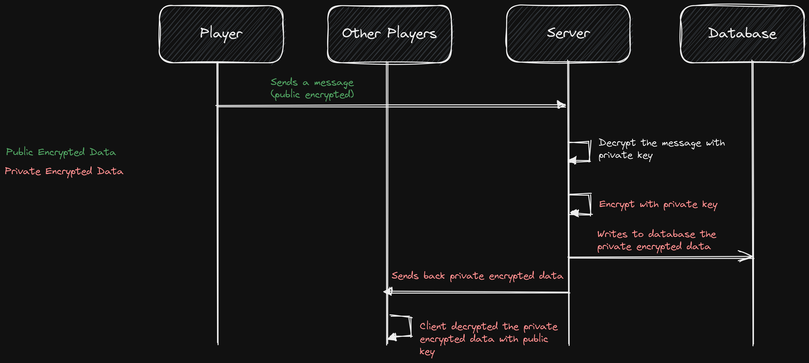

# @troof/encrypt

This package contains the encryption and decryption libraries for end-to-end encryption of text message data.

### Encryption model

The picture below explains everything about how the messages are encrypted

